# 车牌检测角点变换识别

## 模型
车牌检测模型：[https://share.weiyun.com/8QCIxQ5c](https://share.weiyun.com/8QCIxQ5c) <br>
车牌角点检测模型：[https://share.weiyun.com/utvA1lux](https://share.weiyun.com/utvA1lux) <br>
车牌识别模型：[链接：https://share.weiyun.com/eCoQE1H2](链接：https://share.weiyun.com/eCoQE1H2) <br>
下载好的模型放入到models目录中<br>
## 数据集
下载CCPD数据集的部分数据 [https://share.weiyun.com/gPcIEz0v](https://share.weiyun.com/gPcIEz0v) <br>
解压放到项目data目录里面，这里只用到了CCPD数据集里面部分数据 <br>
 
## 运行
设置detect.py里面source为图片路径，generate_crnn_trainset = False, 然后运行就可以 <br>
$python detect.py <br>

## 数据预处理
这个处理会生成车牌检测的数据集和角点检测的数据集，车牌识别的数据集会在后面生成 <br>
$python processes.py <br>

## 训练车牌检测模型
配置voc.yaml，这里修改路径和类别以及类别数量就可以，类别数量和类别已经配置好了<br>
配置yolov5l.yaml这里修改类别数量就好，已经修改好了的nc:1<br>
下载darknet53.conv.74模型放入到weights目录中[https://share.weiyun.com/8DBgEbZU](https://share.weiyun.com/8DBgEbZU) <br>
$python train.py --data voc.yaml --cfg yolov5l.yaml --weights  ./weights/darknet53.conv.74  --batch-size 16 <br>
### 查看检测效果 
$python detect_plate.py --source ./data/stage1/test  --weights  ./runs/exp9/weights/best.pt --conf 0.4 <br>
#### 检测效果展示
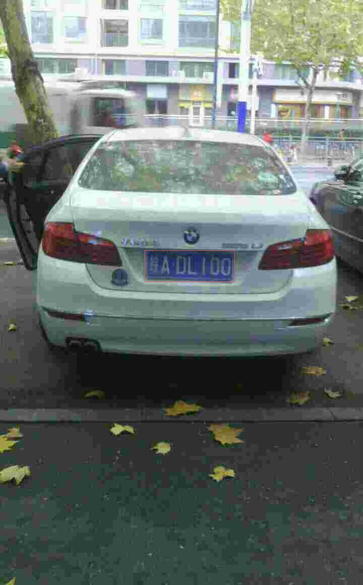<br>

## 训练车牌角点检测模型
$python train_corner_detection.py <br>
### 查看检测效果
$python corner_detect.py <br>
#### 检测效果展示
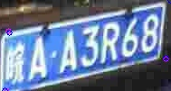 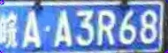<br>
<i></i>
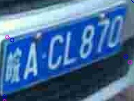 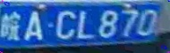<br>
<i></i>
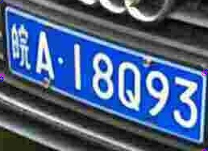 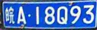<br>
<i></i>
## 训练车牌文字识别模型
### 生成训练数据
设置好车牌检测模型路径和车牌角点检测模型路径，plate_detect_model=*，corner_detect_model=*，generate_crnn_trainset = True <br>
生成训练数据<br>
$python detect.py 

安装warp-ctc<br>
```bash
git clone https://github.com/SeanNaren/warp-ctc.git
cd warp-ctc
mkdir build; cd build
cmake ..
make
cd ../pytorch_binding
python setup.py install
cd ../
```
验证warp-ctc是否安装成功，能正常导入包就安装好了<br>
```python
import torch
from warpctc_pytorch import CTCLoss
```

### 训练识别模型
$cd CRNN_Chinese_Characters_Rec <br>
修改文件里面输入图片的路径CRNN_Chinese_Characters_Rec\lib\config\OWN_config.yaml：ROOT<br>
修改文件里面的字符CRNN_Chinese_Characters_Rec\lib\config\alphabets.py：alphabet = ''，中文车牌的字符就是这些可以不用修改<br>
$python train.py
### 验证识别效果
$cd CRNN_Chinese_Characters_Rec <br>
$python demo.py

### 三阶段整体检测识别
$cd yolov5
设置generate_crnn_trainset = False
$python detect.py

#### 整体识别效果展示
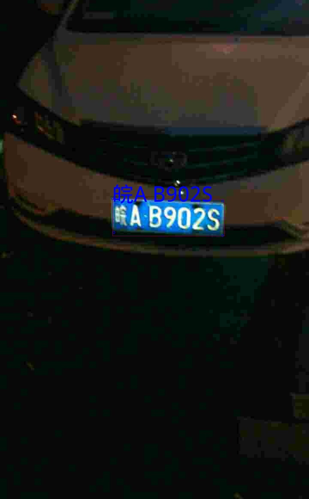
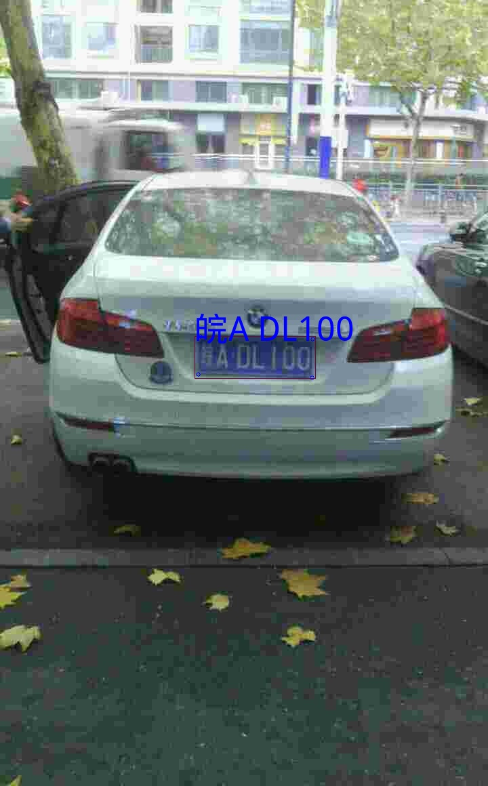
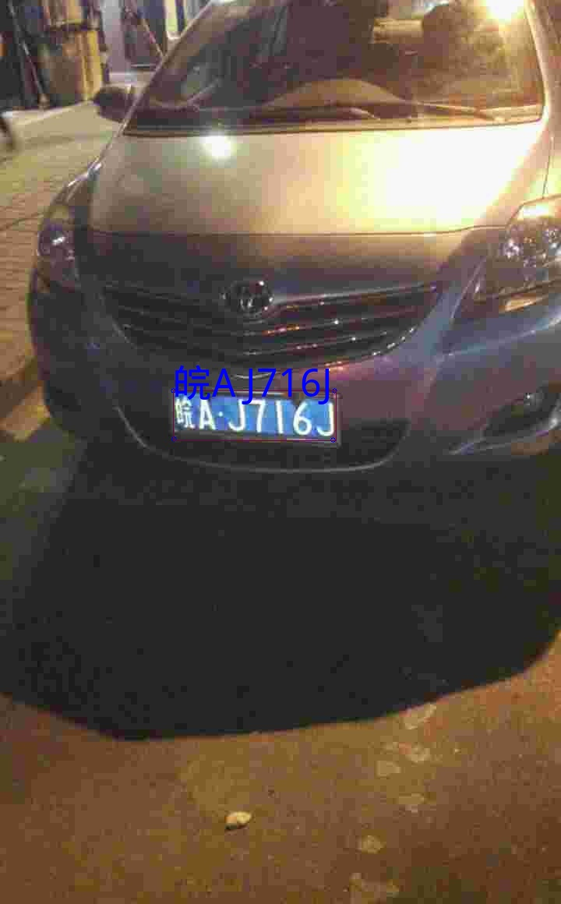

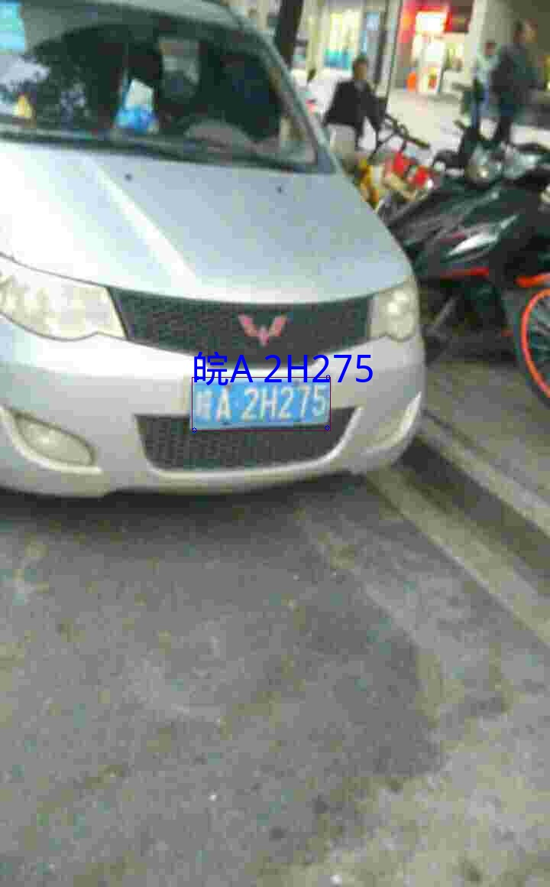
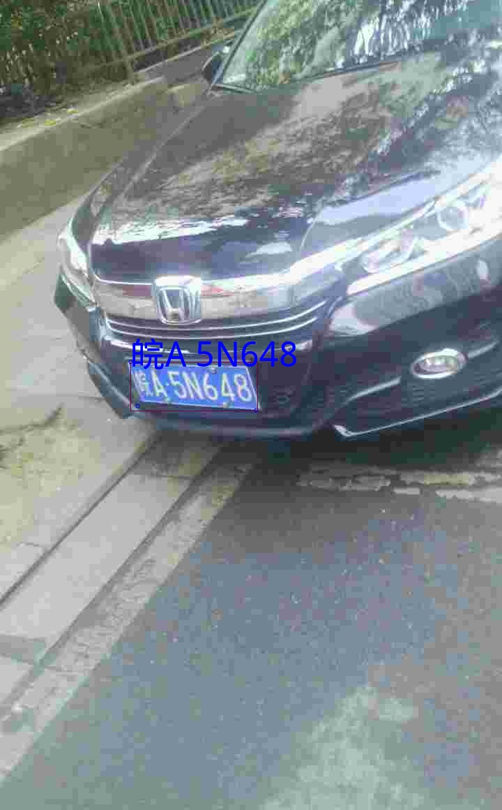

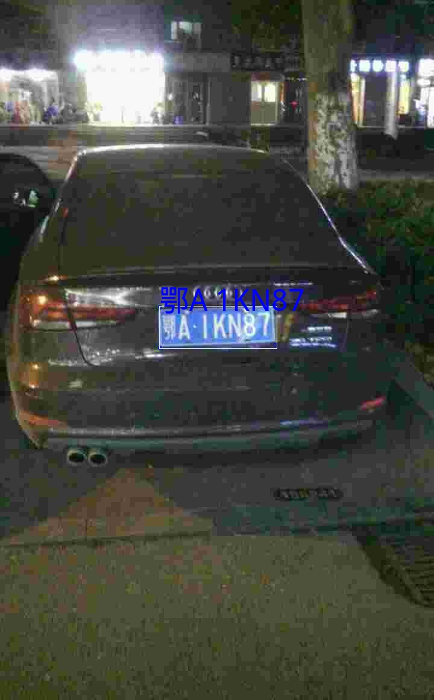
<i></i>
License
~~~~~~~
`Free software: MIT license <https://github.com/shiheyingzhe/plate_detect_corner_warp_recognize/LICENSE>`_
Citation: ZouJiu. plate_detect_corner_warp_recognize. Git code (2020). https://github.com/shiheyingzhe/plate_detect_corner_warp_recognize